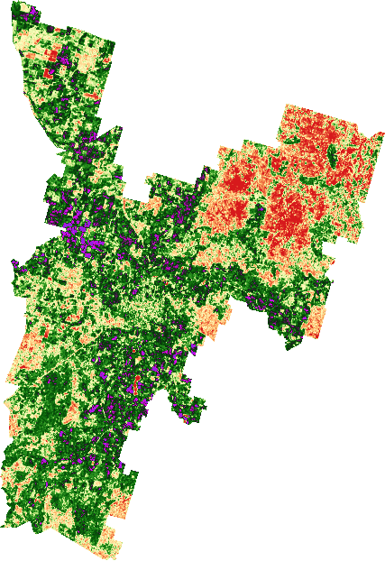

# AFM API

## Endpoints

See our [online AFM API docs](https://data.afm.cibolabs.com/swagger) for 
the list of endpoints.

## Examples

These examples use the curl program in a linux terminal
to send requests to the API. They assume:
- you have curl installed
- you have exchanged your credentials for an access token
  (see the [Quick start](quickstart.md) for how to do this).
  The access token is stored in the `TOKEN` variable

### /getimagedates 

**Request**

GET https://data.afm.cibolabs.com/getimagedates 

```bash
curl -s -X GET \
    --output data.json \
    -H "Content-Type: application/json" \
    -H "Authorization: Bearer ${TOKEN}" \
    "https://data.afm.cibolabs.com/getimagedates
```

**Response** 

```json
{ 
  "dates": ["20170105", "20170110", ...] 
}
```

### /gettsdmstats with a single Feature

In this example, the geojson is supplied in the request's body.
The geojson contains a single Feature.

Important: the coordinate reference system of the geojson must conform to 
the standard. That is, a geographic coordinate reference system using the 
World Geodetic System 1984 (WGS 84) datum, with longitude and latitude in
decimal degrees.

**Request**

POST https://data.afm.cibolabs.com/gettsdmstats?startdate=20240101&enddate=20251231&percentiles=5,95

```bash
geojson_file="your_area_of_interest.geojson" 
geojson=$(cat "$geojson_file") 
startdate="20240101" 
enddate="20251231" 
percentiles="5,95"
curl -s -X POST \
    --output data.json \
    -H "Content-Type: application/json" \
    -H "Authorization: Bearer ${TOKEN}" \
    -d "$geojson" \
    "https://data.afm.cibolabs.com/gettsdmstats?startdate=$startdate&enddate=$enddate&percentiles=$percentiles" 
```

 
**Body**

```json
{ 
  "type": "Feature", 
  "properties": { 
    "name": "feature_a", 
  }, 
  "geometry": { 
    "type": "Polygon", 
    "coordinates": [ 
      ... 
    ] 
  } 
}
```

**Response** 

Notes: 
- attributes on input features are returned unchanged 
- geometry is returned unchanged 
- stats are inserted in the stats list
- captured is the percentage of the geometry’s area that is unaffected by 
  cloud or water and within the territory’s extent
- area is the geometry’s area in hectares 

 
```json
{ 
  "type": "Feature", 
  "properties": { 
    "name": "feature_a", 
    "stats": [ 
      { 
        "measure": "tsdm", 
        "unit": "kg/ha", 
        "dates": ["20250101", "20250106", ...], 
        "captured": [100, 100, ...], 
        "median": [2612, 2631, ...], 
        "mean": [2453, 2489, ...], 
        "std": [876, 891, ...], 
        "p5": [301, 312, ...], 
        "p10": [354, 362, ...], 
        "p25": [1987, 1999, ...], 
        "p75": [3001, 3053, ...], 
        "p90": [3122, 3150, ...], 
        "p95": [3182, 3198, ...], 
        "area": 765.90 
      }  
    ] 
  }, 
  "geometry": { 
    "type": "Polygon", 
    "coordinates": [ 
      ... 
    ] 
  }
} 
```

### /gettsdmstats with a FeatureCollection

If the input geojson is a FeatureCollection with multiple Features,
the API aggregates all geometries together and computes one set
of statistics. 

If you want statistics for single feature, you must call the API multiple times, passing just a single feature. 

**Request**

POST https://data.afm.cibolabs.com/gettsdmstats?enddate=20250430&startdate=20250101&percentiles=5,95

```bash
geojson_file="your_area_of_interest.geojson"
geojson=$(cat "$geojson_file")
startdate="20250101"
enddate="20250430"
percentiles="5,95"

curl -s -X POST \
    --output data.json \
    -H "Content-Type: application/json" \
    -H "Authorization: Bearer ${TOKEN}" \
    -d "$geojson" \
    "https://data.afm.cibolabs.com/gettsdmstats?startdate=$startdate&enddate=$enddate&percentiles=$percentiles" 
```


**Body** 

```json
{ 
  "type": "FeatureCollection", 
  "features": [ 
    { 
      "type": "Feature", 
      "properties": { 
        "name": "feature_a" 
      }, 
      "geometry": { 
        "type": "Polygon", 
        "coordinates": [ 
        ...
       ] 
    }, 
    { 
      "type": "Feature", 
      "properties": { 
        "name": "feature_b", 
      }, 
      "geometry": { 
        "type": "Polygon", 
        "coordinates": [ 
        ...
       ] 
    } 
  ]
} 
```

**Response**

Notes:
- The stats returned in each feature are identical,
  and represent the aggregate stats, so you only need to read
  the stats from the first feature
- The response also includes the ‘aggregate’: ‘yes’ property 
- captured is the percentage of the aggregated’ geometry’s area that
  is unaffected by cloud or water and within the territory’s extent
- area is the area of the aggregated geometries in hectares 

```json
{ 
  "type": "FeatureCollection", 
  "features": [ 
    { 
      "type": "Feature", 
      "properties": { 
        "name": "feature_a", 
        "aggregate": "yes" 
        "stats": [ 
          { 
            "measure": "tsdm", 
            "unit": "kg/ha", 
            "dates": ["20250101", "20250106", ...], 
            "captured": [100, 98, ...], 
            "median": [2612, 2631, ...], 
            "mean": [2453, 2489, ...], 
            "std": [876, 891, ...], 
            "p5": [301, 312, ...], 
            "p10": [354, 362, ...], 
            "p25": [1987, 1999, ...], 
            "p75": [3001, 3053, ...], 
            "p90": [3122, 3150, ...], 
            "p95": [3182, 3198, ...], 
            "area": 3832.76 
          }  
        ] 
      }, 
      "geometry": { 
        "type": "MultiPolygon", 
        "coordinates": [ 
        ... 
       ] 
    }, 
    "type": "Feature", 
    "properties": { 
      "name": "feature_b", 
      "aggregate": "yes" 
      "stats": [ 
        { 
          "measure": "tsdm", 
          "unit": "kg/ha", 
          "dates": ["20250101", "20250106", ...], 
          "captured": [100, 98, ...], 
          "median": [2612, 2631, ...], 
          "mean": [2453, 2489, ...], 
          "std": [876, 891, ...], 
          "p5": [301, 312, ...], 
          "p10": [354, 362, ...], 
          "p25": [1987, 1999, ...], 
          "p75": [3001, 3053, ...], 
          "p90": [3122, 3150, ...], 
          "p95": [3182, 3198, ...], 
          "area": 3832.76 
        }  
      ] 
    }, 
    "geometry": { 
      "type": "MultiPolygon", 
      "coordinates": [ 
        ... 
      ] 
    } 
  ]
}
```

### /gettsdmthumbail

The thumbnail endpoints return a PNG format image. Some endpoints take a point and a buffer size and others
take a GeoJSON in the POST body - please check the swagger docs for these details. It is important that
you specify the `Accept: image/png` HTTP header so that the response is formatted properly.

**Request**

POST https://data.afm.cibolabs.com/gettsdmthumbail

```bash
geojson_file="your_area_of_interest.geojson"
geojson=$(cat "$geojson_file")

curl -s -X POST \
    --output data.json \
    -H "Content-Type: application/json" \
    -H "Authorization: Bearer ${TOKEN}" \
    -H "Accept: image/png" \
    -d "$geojson" \
    "https://data.afm.cibolabs.com/gettsdmthumbail" 
```


**Body** 

```json
{ 
  "type": "FeatureCollection", 
  "features": [ 
    { 
      "type": "Feature", 
      "properties": { 
        "name": "feature_a" 
      }, 
      "geometry": { 
        "type": "Polygon", 
        "coordinates": [ 
        ...
       ] 
    }, 
    { 
      "type": "Feature", 
      "properties": { 
        "name": "feature_b", 
      }, 
      "geometry": { 
        "type": "Polygon", 
        "coordinates": [ 
        ...
       ] 
    } 
  ]
} 
```

**Response**

Response will be an image in PNG format. Below is an example:




## Chaining

You can chain multiple calls to the AFM API endpoints together, in sequence.
When chaining, pass the returned geojson from one request
as the body of the next request.
Statistics are appended to the geojson's Feature on each call.

Note that the thumbnail endpoints return PNG, not JSON so they cannot be 
chained in the same way.


### Chaining example

In this example we chain three calls together:

- /getpointtsdmstats
- /getfcstats
- /getrain

/getpointtsdmstats takes a point location (latitude and longitude) and a buffer
radius, in metres, around the point. It returns a geojson with statistics for
the pasture biomass for the area within the circle.

The next call, to /getfcstats, uses the returned geojson in the
request body. The fractional cover statistics are appended to the feature's
list of stats.

Similarly, the call to /getrain uses the geojson returned from the previous
request appends the rainfall statistics to the feature's stats.

Summary of requests:

```
GET https://data.afm.cibolabs.com/getpointtsdmstats?lat=-23.52&lon=148.16&buffer=5000&startdate=20240101&enddate=20241231&percentiles=10,25,50,75,90

POST https://data.afm.cibolabs.com/getfcstats?startdate=20240101&enddate=20241231&percentiles=10,25,50,75,90

POST https://data.afm.cibolabs.com/getrain?startdate=20240101&enddate=20241231
```

In detail:

```
startdate="20240101"
enddate="20241231"
lat="-23.52"
lon="148.16"
buffer="5000"
percentiles="10,25,50,75,90"

# First call to /getpointtsdmstats
curl -s -X GET \
    --output output_1.json \
    -H "Content-Type: application/json" \
    -H "Authorization: Bearer ${TOKEN}" \
    "https://data.afm.cibolabs.com/getpointtsdmstats?lat=$lat&lon=$lon&buffer=$buffer&startdate=$startdate&enddate=$enddate&percentiles=$percentiles"


# The second call, to /getfcstats, uses the geojson returned from the first call
geojson=$(cat output_1.json)
curl -s -X POST \
    --output output_2.json \
    -H "Content-Type: application/json" \
    -H "Authorization: Bearer ${TOKEN}" \
    -d "$geojson" \
    "https://data.afm.cibolabs.com/getfcstats?startdate=$startdate&enddate=$enddate&percentiles=$percentiles"

# The third call, to /getrain, uses the geojson returned from the second call
geojson=$(cat output_2.json)
curl -s -X POST \
    --output output_3.json \
    -H "Content-Type: application/json" \
    -H "Authorization: Bearer ${TOKEN}" \
    -d "$geojson" \
    "https://data.afm.cibolabs.com/getrain?startdate=$startdate&enddate=$enddate"
```

The final output, in `output_3.json` has a list of stats objects, one for
each measure (tsdm, fcbare, fcgreen, fcdead, rain):

```json
{
  "type": "FeatureCollection",
  "features": [
    {
      "type": "Feature",
      "properties": {
        "centre_lat": -23.52,
        "centre_lon": 148.16,
        "buffer": 5000.0,
        "aggregate": "yes",
        "stats": [
          {
            "unit": "kg/ha",
            "measure": "tsdm",
            "area": 7850.393436441231,
            "dates": [
              "20240104",
              "20240109",
              "20240114",
              ...
            ],
            "captured": [
              99.0151017728168,
              99.21208141825345,
              98.91661195009848,
              ...
            ],
            "mean": [
              2092.376967688484,
              2213.5574855252275,
              2286.963915387806,
              ...
            ],
            ...
          },
          {
            "unit": "%",
            "measure": "fcbare",
            "area": 7850.393436441231,
            "dates": [
              "20240104",
              "20240109",
              "20240114",
              ...
            ],
            ...
          },
          {
            "unit": "%",
            "measure": "fcgreen",
            "area": 7850.393436441231,
            "dates": [
              "20240104",
              "20240109",
              "20240114",
              ...
            ],
            ...
          },
          {
            "unit": "%",
            "measure": "fcdead",
            "area": 7850.393436441231,
            "dates": [
              "20240104",
              "20240109",
              "20240114",
              ...
            ],
            ...
          },
          {
            "unit": "mm",
            "measure": "rain",
            "area": 7850.393436441231,
            "dates": [
              "202401",
              "202402",
              "202403",
              ...
            ],
            ...
          }
        ]
      },
      "geometry": {
        "type": "Polygon",
        "coordinates": [
          [
            ...
          ]
        ]
      }
    }
  ]
}
```

### Valid chaining sequences

The follow chain of calls is supported, where [name] can be replaced with
tsdm, tsdmgreen, tsdmdead and fc. 

- /getpoint[name]stats followed by any number of /get[name]stats and /getrain
  (as in the example above)
- /get[name]stats followed by any number of /get[name]stats and /getrain 
- /getrain followed by any number of /get[name]stats 
- /getpointrain followed by any number of /get[name]stats 

## Handling special cases

### Calculating statistics for multiple features

If you pass the API a FeatureCollection in the request body, it
calculates one set of statistics for the aggregated area.
The statistics are identical for every feature in the response. So you only
need to read the statistics from the first feature in the response.
The response also contains an "aggregate=yes" property.

To calculate statistics for multiple features individually, you must
call the API multiple times, passing a single feature in each request.

### Handling the response time-out limit of 30 seconds

The API has a time-out period of 30 seconds. You may need to shorten the
time-period (`startdate` and `enddate` parameters) of your request, and
make multiple calls to the API.

If you wish, you may chain the requests with different start and end dates.
A new stats object for the second request is appended to the stats
list of the Feature's properties.

For example. Your first request to `/gettsdmstats` is for the year 2023
(`startdate=20230101&enddate=20231231`). The response is chained with a 
second request to `gettdsmstats` for the year 2024
(`startdate=20240101&enddate=20241231`). The output contains two stats objects
in the stats list, one for each year.

```json
{ 
  "type": "Feature", 
  "properties": { 
    "name": "feature_a",
    "aggregate": "yes",
    "stats": [ 
      { 
        "measure": "tsdm", 
        "unit": "kg/ha",
        "area": 7850.393436441231
        "dates": [
              "20230104",
              "20230109",
              ...,
              "20231230"
        ],
        ... 
      }, 
      { 
        "measure": "tsdm", 
        "unit": "kg/ha", 
        "area": 7850.393436441231
        "dates": [
              "20240104",
              "20240109",
              ...,
              "20241230"
        ],
        ...
      }  
    ] 
  }, 
  "geometry": { 
    "type": "Polygon", 
    "coordinates": [ 
      ... 
    ] 
  }
}
```

### Handling the request and response size limit of 6 MB

The maximum size of a request's body or the response is 6MB.
This cannot be increased. You must restructure your requests if
you hit this limit.
